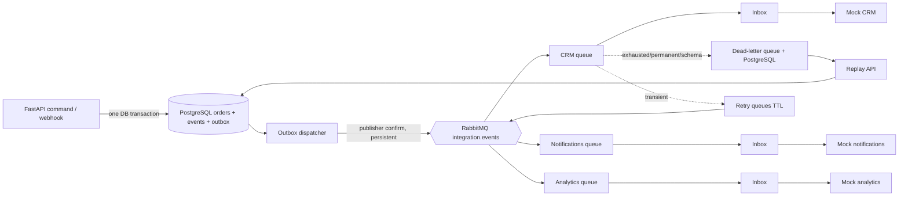

# Event-Driven Integration Platform

A local reference implementation of reliable event-driven integrations using native PostgreSQL 16, RabbitMQ, a transactional outbox, idempotent consumers, bounded retries, dead letters, replay, signed webhook ingress, schema evolution and a real XYFlow delivery canvas.

Publishing a message is easy. Preserving a business event through database commits, broker failures, duplicate delivery, external side effects, retries, poison messages and schema changes is the engineering problem. This repository makes those failure modes executable.

## Reliability contract

| Concern | Failure risk | Implementation |
| --- | --- | --- |
| DB → broker | Lost event after commit | Transactional outbox |
| Publish ambiguity | Confirm/DB crash window | At-least-once + consumer idempotency |
| Duplicate delivery | Repeated side effect | Inbox + connector idempotency key |
| Transient failure | Temporary outage | Bounded retry queues |
| Poison message | Infinite loop | Dead-letter path |
| Recovery | Manual data surgery | Durable replay intent through outbox |
| Webhook ingress | Duplicate/forged delivery | HMAC + source idempotency |
| Schema change | Consumer incompatibility | Version registry + upcaster |

## Architecture



The system deliberately promises **at-least-once delivery with idempotent processing**, never exactly-once delivery. A publisher confirm and the database update are not one transaction: a crash in between can publish the same event again. Consumers check `(consumer_name, event_id)` in the inbox before calling a connector, and destinations enforce the event ID as an idempotency key for the remaining external-side-effect crash window.

## Run locally

```powershell
# PowerShell as Administrator, once per machine
.\scripts\setup-native.ps1
.scripts\configure-postgres.ps1
Start-Service RabbitMQ
```

This project intentionally uses native services, not Docker. PostgreSQL and RabbitMQ remain real infrastructure; no embedded queue or SQLite substitute is used.

```bash
cd backend
python -m venv .venv
# PowerShell: .\.venv\Scripts\Activate.ps1
# Unix: source .venv/bin/activate
pip install -e ".[dev]"
alembic upgrade head  # SQLAlchemy startup creation is also available for the demo
uvicorn app.main:app --reload
```

In another terminal:

```bash
cd backend
python -m app.workers.run
```

And for the explorer:

```bash
cd frontend
npm install
npm run dev
```

RabbitMQ management is optional at http://localhost:15672 (guest/guest). Create an order with `POST /api/orders`, then inspect `/api/events`, `/api/outbox`, `/api/deliveries` and `/api/dead-letters`. The demo controls are `PUT /api/demo/connectors/{connector}/failure-mode` and `POST /api/demo/reset`.

## Schema, webhook and evaluation

`customer.updated` v1 is validated and explicitly upcast to v2 with `email_verified=false`; future versions are rejected as schema errors. The mock commerce signer is runnable with `python -m app.webhook.send_demo`. The deterministic evaluation command is `python -m app.evaluation.run` and enumerates the 15 required scenarios from the master specification.

## Roadmap

1. Foundation: Compose, typed envelope, PostgreSQL models and API.
2. Delivery: outbox leases, publisher confirms, durable topic topology and manual-ACK workers.
3. Reliability: inbox deduplication, connector idempotency, failure taxonomy, bounded retry and DLQ.
4. Recovery and boundaries: durable replay, HMAC webhook dedupe, schema upcasting and trace persistence.
5. Experience: XYFlow canvas, event explorer, inspectors and scenario controls.
6. Quality: 15-scenario evaluation, integration tests, CI, documentation and main/dev promotion.

## What this is not

Not a generic iPaaS, workflow engine, Kafka tutorial, connector marketplace, ETL runtime, distributed transaction system or exactly-once platform. PostgreSQL and RabbitMQ are intentionally sufficient to make the delivery trade-offs inspectable.

See [docs/decisions.md](docs/decisions.md) and [event-driven-integration-platform-master-spec.md](event-driven-integration-platform-master-spec.md) for the complete design record.
